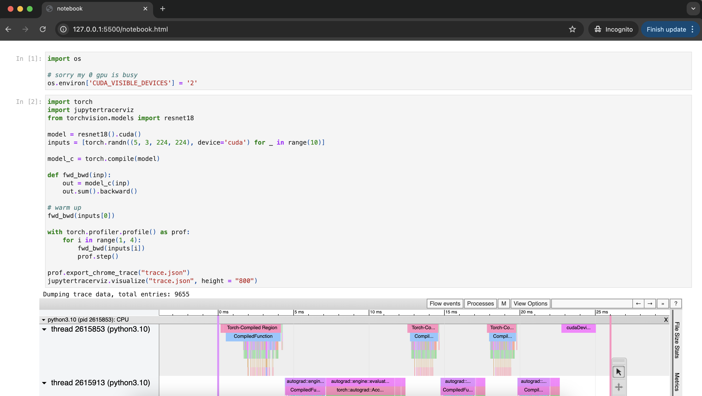

# JupyterTracerViz

Visualize multiple trace.json in Jupyter Notebook cell, also include multi-GPUs pseudo-REPL.

## Installation

```
pip3 install git+https://github.com/huseinzol05/JupyterTracerViz
```

## How to visualize profiling

### Single GPU

I take example profiling from https://pytorch.org/docs/stable/torch.compiler_profiling_torch_compile.html,

```python3
import torch
import jupytertracerviz
from torchvision.models import resnet18

model = resnet18().cuda()
inputs = [torch.randn((5, 3, 224, 224), device='cuda') for _ in range(10)]

model_c = torch.compile(model)

def fwd_bwd(inp):
    out = model_c(inp)
    out.sum().backward()

# warm up
fwd_bwd(inputs[0])

with torch.profiler.profile() as prof:
    for i in range(1, 4):
        fwd_bwd(inputs[i])
        prof.step()

prof.export_chrome_trace("trace.json")
jupytertracerviz.visualize("trace.json", height = "800")
```


After that you can import to HTML if you want,

```bash
jupyter nbconvert --to html single-gpu.ipynb
```



Full example at [single-gpu.ipynb](single-gpu.ipynb).

### Multi-GPUs

Sometime you want to profile trace from multiple GPUs,

```python
from accelerate import notebook_launcher
import time
import os
import jupytertracerviz
from glob import glob

def training_loop():
    
    import os
    
    world_size = int(os.environ['WORLD_SIZE'])
    local_rank = int(os.environ['LOCAL_RANK'])
    
    import torch
    import torch.nn as nn
    import torch.nn.functional as F
    from torch.distributed.tensor.parallel import parallelize_module, ColwiseParallel
    from torch.distributed.tensor import distribute_tensor
    from torch.distributed.device_mesh import init_device_mesh
    from torch.distributed.tensor.placement_types import Shard
    import torch.distributed as dist
    
    torch.cuda.set_device(local_rank)

    class FeedForward(nn.Module):
        def __init__(self, dim, hidden_dim):
            super().__init__()
            self.w1 = nn.Linear(dim, hidden_dim, bias=False)
            self.w2 = nn.Linear(hidden_dim, dim, bias=False)
            self.w3 = nn.Linear(dim, hidden_dim, bias=False)

        def forward(self, x):
            w1 = self.w1(x)
            w3 = self.w3(x)
            return self.w2(F.silu(w1) * w3)
    
    model = FeedForward(8192, 8192)
    device_mesh = init_device_mesh('cuda', (world_size,))
    linears = {name: ColwiseParallel(use_local_output = False) \
               for name, submodule in model.named_modules() \
               if isinstance(submodule, nn.Linear)}
    model = parallelize_module(model, device_mesh, linears)
    
    dummy_input = torch.randn(8192, 8192).cuda()
    
    if local_rank == 0:
        print(model.w3.weight.shape, model.w3.weight._local_tensor.shape)
    
    with torch.profiler.profile(
        activities=[
            torch.profiler.ProfilerActivity.CPU,
            torch.profiler.ProfilerActivity.CUDA,
        ],
        record_shapes = True, profile_memory = True,
    ) as prof:
        output = model(dummy_input)
    dist.barrier()
    time.sleep(local_rank * 0.1)
    print(local_rank, output.shape)
    dist.barrier()
    
    prof.export_chrome_trace(f'trace_{local_rank}.json')

notebook_launcher(training_loop, num_processes = 3, use_port = '29501')
jupytertracerviz.visualize(glob('trace_*.json'), height = "800")
```


Full example at [single-gpu.ipynb](single-gpu.ipynb).

## How to Multi-GPUs REPL

Debugging Multi-GPUs processing is hard to debug because it required to run as multiprocessing and not possible to REPL, but now you can!

First you must initialize using `init_multigpus_repl`,

```python
from jupytertracerviz import init_multigpus_repl, multigpus
init_multigpus_repl()

%%multigpus

model = torch.nn.Linear(10, 10).cuda(rank)

x = torch.randn(10, 10).cuda(rank)
output = model(x)

print(f"Rank {rank}: Output sum {output.sum().item()}")

%%multigpus

from torch.distributed.tensor.parallel import parallelize_module, ColwiseParallel
from torch.distributed.device_mesh import init_device_mesh

class FeedForward(nn.Module):
    def __init__(self, dim, hidden_dim):
        super().__init__()
        self.w1 = nn.Linear(dim, hidden_dim, bias=False)

    def forward(self, x):
        w1 = self.w1(x)

model = FeedForward(8192, 8192)
device_mesh = init_device_mesh('cuda', (3,))
linears = {name: ColwiseParallel(use_local_output = False) \
           for name, submodule in model.named_modules() \
           if isinstance(submodule, nn.Linear)}
model = parallelize_module(model, device_mesh, linears)

%%multigpus

print(model.w1.weight)
```


Full example at [multigpus-repl.ipynb](multigpus-repl.ipynb).